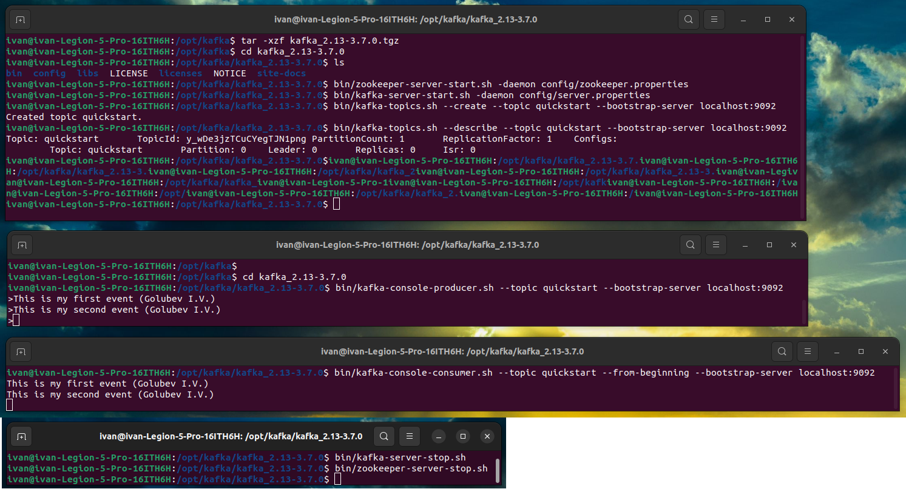

# Домашнее задание № 1



<p style="text-align: center;">Рис. 1</p>
На рис. 1 в первом консольном окне:

1. Разархивирован файл с кафкой ```tar -xzf kafka_2.13-3.7.0.tgz```
2. Запущен Zookeeper ```bin/zookeeper-server-start.sh -daemon config/zookeeper.properties```
3. Запущена Kafka ```bin/kafka-server-start.sh -daemon config/server.properties```
4. Создан топик quickstart ```bin/kafka-topics.sh --create --topic quickstart --bootstrap-server localhost:9092```
5. Выведена информация о созданном топике ```bin/kafka-topics.sh --describe --topic quickstart --bootstrap-server localhost:9092```

На рис. 1 во втором консольном окне создан producer для созданного топика
```bin/kafka-console-producer.sh --topic quickstart --bootstrap-server localhost:9092``` и в
топик отправлено 2 сообщения

На рис. 1 во втором консольном окне создан consumer для созданного топика
```bin/kafka-console-consumer.sh --topic quickstart --from-beginning --bootstrap-server localhost:9092``` и получено
2 сообщения из топика