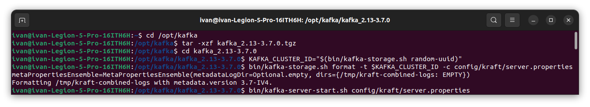
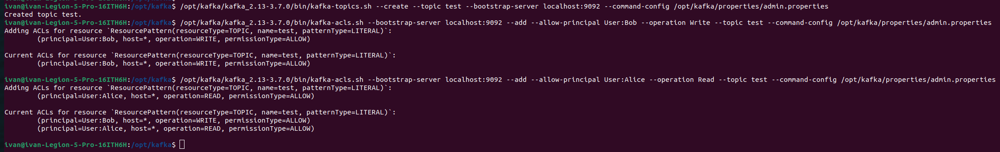
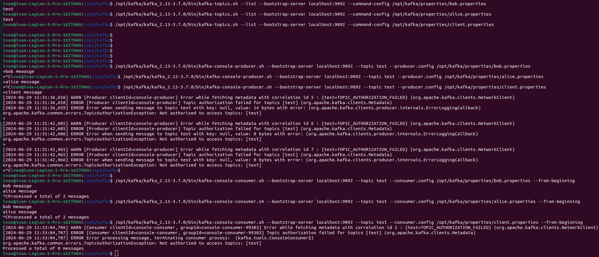

# Домашнее задание № 2 (авторизация SASL_PLAINTEXT в режиме Kraft)

Рис. 1

На рис. 1 Запускается Kafka с Kraft: сгенерировано UUID кластера, отформатировваны папки для журналов, запущен брокер

Рис. 2

На рис. 2 создан топик test. Первому пользователю (Bob) выданы права на запись в этот топик. Второму пользователю (Alice)
выданы права на чтение этого топика. Третьему пользователю (Client) не выданы никакие права на этот топик

Рис. 3

На рис. 3 От имени каждого пользователя выполны команды:
* Получить список топиков
* Записать сообщения в топик
* Прочитать сообщения из топика